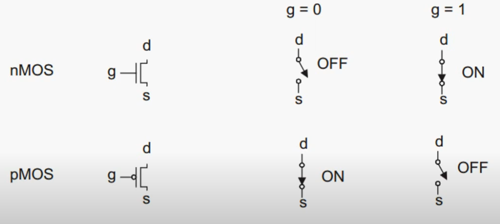
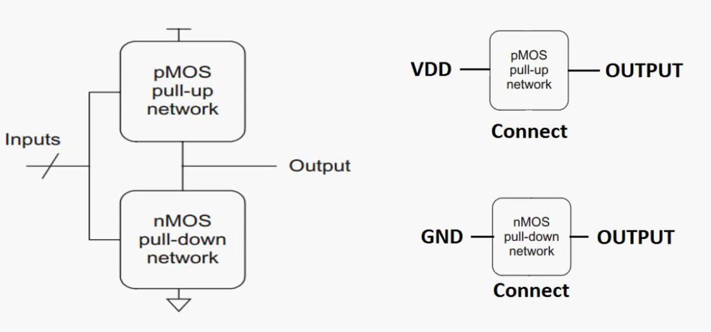
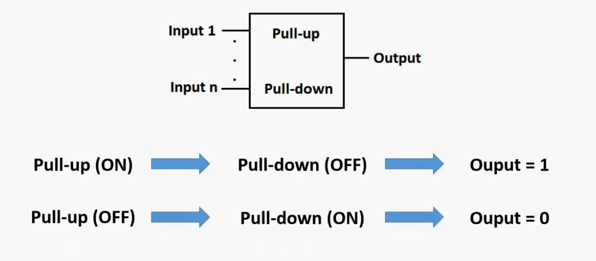
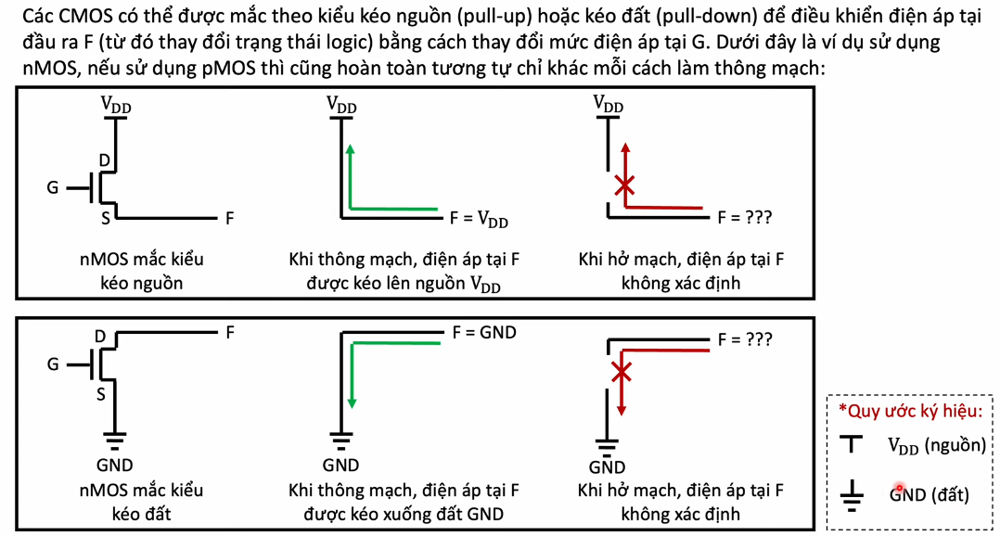

# CMOS - Complementary Metal-Oxide Semiconductor
1. Khái niệm cơ bản về CMOS
    - Là một công nghệ chế tạo vi mạch được sử dụng rộng rãi trong ngành công nghiệp điện tử để tạo ra các vi mạch tích hợp (IC).
    - Tiêu thụ điện năng thấp + tốc độ cao.
    => Hợp chất Si pha tạp với i-on Dương hoặc Âm 

    * PMOS (P-channel MOSFET) - (PULL-UP network)
        - Dẫn điện khi tín hiệu đầu vào là thấp (logic 0)

    * NMOS (N-channel MOSFET) - (PULL-DOWN network )
        - Dẫn điện khi tín hiệu đầu vào là cao (logic 1)

* PULL-UP and PULL-DOWN NETWORK
    - PULL-UP NETWORK
    - PULL-DOWN NETWORK

* GATE LOGIC

    NMOS + PMOS => cổng logic => giảm tiêu thụ điện năng.

2. Nguyên lý hoạt động 
    - Khi một transistor dẫn điện (ON), transistor còn lại sẽ ngắt (OFF), giúp giảm thiểu dòng điện rò rỉ (leakage current).

3. Quy trình chế tạo CMOS
    - Tạo lớp oxide
    - Tạo cổng (Gate)
    - Tạo vùng nguồn và thoát (Source và Drain)
    - Tạo kết nối kim loại
