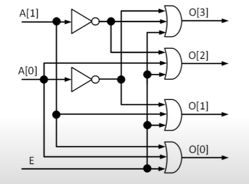

# MẠCH TỔ HỢP LÀ GÌ ? 
- Mạch tổ hợp(combinational circuit) là mạch mà trạng thái/ giá trị ngõ ra chỉ phụ thuộc vào trạng thái/ giá trị ngõ vào hiện tại (current input state)
- Ví dụ:


Hình A là mạch tổ hợp
Hình B không phải là mạch tổ hợp (do có mạch hồi tiếp).

## Đặc điểm mạch tổ hợp
- Cấu tạo từ các cổng logic khác nhau
- Trạng thái ngõ ra đáp ứng ngay lập tức theo trạng thái ngõ vào (bỏ qua độ trễ vật lý trên các cổng logic và dây dẫn)
- Không có khả năng nhớ (lưu trữ) 
- Không chứa đường HỒI TIẾP (feeedback)


--------------------------------------------------------------
# MÔ TẢ RTL CODE CHO MẠCH TỔ HỢP

1. Khai báo tín hiệu (signal)
- cú pháp: "kieu_du_lieu" [MSB:LSB] "ten_tin_hieu";
- kieu du lieu: wire hoặc reg
- ví dụ:
    + wire [7:0] sel;
    + reg [2:0] we;

2. Biểu diễn một giá trị (value)
- Cú pháp: "so_bit"'"co_so" "gia_tri"
- ví dụ:
    + 8'b00010010 - giá trị binary 8 bit
    + 8'h12 - giá trị hexadiciaml 8 bit
    + 8'd18 hoặc 18 - giá trị decimal 8 bit
    + 8'o022 - giá trị octal 8 bit 

------------------------------------------------
## (1) sử dụng "assign" va toan tu dieu kien "?:"

- Tên gọi: Continuous assign statements
- Cú pháp:
    + assign "tin hieu duoc gan" = "bieu thuc"
    + Kiểu dữ liệu của tín hiệu được gán: "wire"
- Toán tử điều kiện:
    + <điều kiện>? <biểu thức đúng>: <biểu thức sai>

## (2) sử dụng "assign" va toan tu dieu kien "?:" mô tả:


``` sh
# khai bao tin hieu 
wire [3:0] O;
wire [3:0] temp;

# logic
# neu E = 1 thi O = 4'b1111 và ngược lại 
assign O = E? 4'b1111: temp;

assign temp = (A == 2'b00)? 4'b1110:
(A == 2'b01)? 4'b1101:
(A == 2'b10)? 4'b1011: 4'b0111;

```

-----------------------------------
## (1) Sử dụng "assign" và toán tử bitwise 
* Toán tử bitwise:


Vi du: mo ta


``` bash

wire [3:0] O;

assign O[0] = E | A[0] | A[1];
assign O[1] = E | ~A[0] | A[1];
assign O[2] = E | A[0] | ~A[1];
assign O[3] = E | ~A[0] | ~A[1];

```

-----------------------------------------------
## Sử dụng "always" và toán tử "bitwise"

- Kiểu dữ liệu được gán trong always: reg
- Cách mô tả:
NOTE: 
- Phải khai báo reg

```bash
    always @ (<danh sachs do nhay>) begin
    <mo ta mach logic>
    end

    # @ (<danh sach do nhay>): Event control
    # begin ... end : sequential block 
---------------------------------------------

    # phai khai bao reg
    reg [3:0] O;

    # always @* begin
    # always @ (*) begin
    always @ (E, A) begin
        assign O[0] = E | A[0] | A[1];
        assign O[1] = E | ~A[0] | A[1];
        assign O[2] = E | A[0] | ~A[1];
        assign O[3] = E | ~A[0] | ~A[1];
    end
```

------------------------------------------------
## Sử dụng "always" và "if/else" và "case"


------------------------------------------------
## Sử dụng FUNCTION 
1. Khai báo: định nghĩa chức năng
2. Gọi function: dùng function -> tạo mạch logic mong muốn

=> Khai báo và gọi ở đâu ?
* Việc khai báo và gọi function thực hiện bên trong module
    - Viết trực tiếp trong module
    - Viết trong file khác rồi include trong module 
* systax:\


* Ví dụ 1:


* Ví dụ 2:


------------------------------------------
## Sử dụng "primitive" có sẵn:
- Verilog hỗ trợ các phần tử mô hình hóa các cổng logic gọi là primitive như:
    + and, nand, nor, or, xor, xnor =>>> là 1 output, nhiều input
    + not và buf ==>> là loại 1 input, nhiều output
- Sử dụng ptimitive =>> mạch nguyên lý chuyển về các cổng cơ bản.
- Cách dùng: 
```bash
        <ten_primitive> (<output>, <input)
```
- Ví dụ:


- Thực tế không dùng ptimitive:
    + Phải chuyển về mạch nguyên lý các cổng cơ bản
    + code dài khó đọc hiểu

------------------------------------------
# MÔ TẢ RTL CODE MẠCH TỔ HỢP DÙNG SYSTEMVERILOG
1. Sử dụng "always_comb"
    - Cú pháp:
```bash
        always_comb begin
            <mo ta mach logic>
        end
```
    - Kiểu dữ liệu:
        + reg
        + logic (nên dùng trong systemverilog)


## Summary
- Hiểu toán tử cơ bản và thương thường dùng của Verilog khi mô tả "MẠCH TỔ HỢP"
- sử dụng "ASSIGN" và "ALWAYS" khi mô tả "MẠCH TỔ HỢP"
- Xem xét kĩ các lưu trữ.