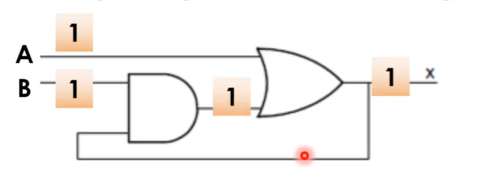

# Mạch tuần tự là gì ?

- Là mạch có trạng thái giá trị ngõ ra phụ thuộc vào trạng thái giá trị ngõ vào hiện tại và trạng thái/ giá trị ngõ vào trước đó (quá khứ)
- Là mạch có trạng thái giá trị ngõ ra phụ thuộc vào trạng thái giá trị ngõ vào hiện tại và trạng thái/ giá trị hiện tại của mạch.




## Điểm hồi tiếp trong mạch tuần tự 


- Bất kì điểm nào không kết nối trực tiếp với một trong các ngõ vào đều có thể làm điểm bắt đầu của đường hồi tiếp trong mạch tuần tự.

1. Mạch tuần tự đồng bộ
    - Sử dụng D Flip Flop
    - D_FF: nhớ tối thiểu 1 chu kì xung clk. Vì nó hoạt động nhờ xung clk 
        + Có thể điều chỉnh chu kì xung clk theo mong muốn
2. Mạch tuần tự bất đồng bộ 

## Đặc tính
1. Tính nhớ (memory)


-----------------------------------------
# D FIP FLOP (Delay FF)
## Hoạt động của D FF
- Hoạt động theo cạnh xung clk
- Ngõ ra Q và Qn -> cập nhật giá trị mới từ ngõ vào D tại cạnh tích cực (active edge) của xung clock (cạnh lên / cạnh xuống).


## RESET 
- Dùng reset xác định giá trị ban đầu của một mạch trước khi nó hoạt động (khởi tạo một giá trị xác định).
1. Reset đồng bộ
* Xảy ra: 
    - Tại cạch tích cực của xung clock khi tính hiệu tích cực mức 0 / 1.


* Vị trí:
    - Mạch reset đồng bộ có thể nằm ngoài hoặc trong D_FF cell 

2. Reset bất đồng bộ 
* Xảy ra:
    - Xảy ra ngay lặp tức khi tín hiệu reset tích cực và không phụ thuốc vào tín hiệu xung clock 


-----------------------------------------
# MÔ TẢ RTL CODE CHO MẠCH TUẦN TỰ (Đồng bộ)


* Cấu trúc "always"
```bash

    always @ (<danh sach do nhay theo canh>) begin
        <mo ta mach logic>
    end

```
- Mô tả cạnh của tín hiệu dùng keyword
    + posedge: Cạnh lên
    + negedge: Cạnh xuống
- Tín hiệu được gán (vế trái biểu thức) phải khai báo kiểu reg
- Dùng phép gán non-blocking (<=) khi mô tả mạch logic

## D FF không có reset


## D FF có reset đồng bộ


## D FF có reset bất đồng bộ 
* FF được reset về mức logic 0


* FF được reset về mức logic 1


- Nếu giá trị reset là 0 thì DFF có chân RESET (RB) được sử dụng để nối đến tín hiệu reset
- Nếu giá trị reset là 1 thì DFF có chân RESET (SB) được sử dụng để nối đến tín hiệu reset 

* FF có thể được reset về cả 2 mức 0 hoặc 1

---------------------------------
# Mô tả mạch tuần từ bằng systemverilog 
``` bash
always_ff @ (<danh sach do nhay>) begin

    <logic>
end
```

- Ví dụ :
    

* MỤC ĐÍCH:
    - Cho phần mềm tổng hợp biết mạch logic tạo ra được mong muốn là mạch tuần tự dùng FF


``` bash

module example (input clk, input reset_0, input reset_1, input in, output reg out);
    always_ff @(posedge clk, negedge reset_0, negedge reset_1) begin
        if (!reset_0 || !reset_1) begin
            out <= 1'b0; // Reset về 0 khi reset_n = 0
        end else begin
            out <= in;    // Gán giá trị data cho out khi không reset
        end
    end

    always @(negede clk) begin
        out <= out
    end
endmodule

```