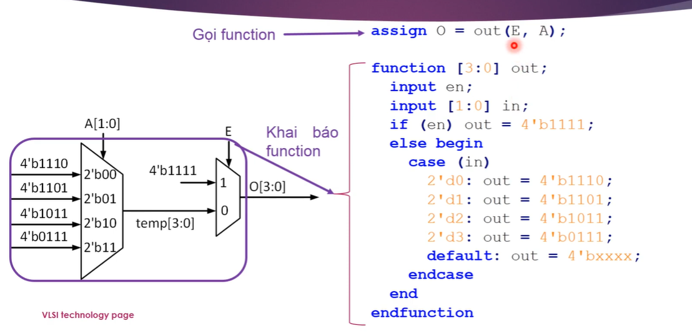

# Verilog Testbench 
https://www.chipverify.com/verilog/verilog-testbench#verilog-testbench-components

# UVM TestBench architecture
https://verificationguide.com/uvm/uvm-testbench-architecture/

https://github.com/snbk001/Verilog-Design-Examples/tree/main

# Document:
https://www.asic-world.com/verilog/veritut.html
https://github.com/m3y54m/FPGA-ASIC-Roadmap


# how to run 
* run on vsode:
    https://www.google.com/search?q=install+iverilog+on+wwindown+10&rlz=1C1KNTJ_enVN968VN968&oq=install+iverilog+on+wwindown+10+&gs_lcrp=EgZjaHJvbWUyBggAEEUYOTIJCAEQIRgKGKABMgkIAhAhGAoYoAEyCQgDECEYChigAdIBCDc3NDJqMGo3qAIAsAIA&sourceid=chrome&ie=UTF-8#fpstate=ive&vld=cid:54afb719,vid:08S6NxUs-Uo,st:0


    https://learningorbis.com/install-icarus-verilog/

    - install iverilog
    - install on mingw

$dumpfile và $dumpvars  để tạo tệp VCD

* Command:
    - build:
    ``` bash
        iverilog -o file.vvp file.v
    ```
    - run testbench:
    ``` bash
        iverilog -o file_tb.vcd file_tb.v file.v
    ```

    - execute:
    ``` bash
        vvp file.vvp/file.vcd 
    ```

* Open wave
    Command:
``` bash
        gtkwave 
```

-----------------------------------------------------------------
* Struture - cấu trúc phần cứng
* Behavioral - cách hoạt động của mạch 

* Data types

    - Nets:
        Keyword: wire
        + Default: 1 bit
        + Default value: Z 
    - Register
        + Keywork: reg 
        + Default: 1 bit
        + Default value: X
    - Vectors
    - Interger, real, time (testbench)

    - String 
    - Array
    - Parameters 
-------------------------------------------------
# CẦN NẮM
1. Đại số Boolean 
2. Cổng và phân tử logic 
    * D flip flop
    * MUX
    * DEMUX


- Mạch tổ hợp
- Mạch tuần tự 
----
- Phương pháp mô tả bằng verilog / systemverilog 

## Thiết kế vi mạch là gì ? What is the integrated circuit design ?


### Phân loại 
Dựa vào đặc điểm về:
* Cấu trúc
* Chức năng
* Mật độ tích hợp \
=> Phân loại 
- Căn cứ trên loại tín hiệu được xử lý: 
    + Vi mạch số (digital IC)
        - Xử lý tín hiệu rời rạc dựa trên mức logic 0/1 
        - Hoặc cạnh (edge) chuyển của tín hiệu (cạnh lên/ cạnh xuống)
        

    + Vi mạch tương tự (Analog IC)
        - Xử lý các tín hiệu liên tục dựa trên: Thuộc tính tần số, điện áp, dòng điện của tín hiệu ,...
        

    + Vi mạch tín hiệu hỗn hợp (Mixed-signal IC)
        - Tích hợp cả xử lý tín hiệu số và tương tự.

- Căn cứ trên mật độ tích hợp: Là dựa vào mật độ số lượng "TRANSISSTOR" hoặc "CMOS" hoăc số "GATE" => để đánh giá mức độ phức tạp của một vi mạch.
    + SSI, MSI, LSI, VLSI, ULSI, GSI

    

- Căn cứ trên chức năng:
    + ASIC (Application-Specific Integrated Cỉcuit)
        - Nó là một loại cấu trúc phần cứng thực hiện các chức năng như chip Vi Điều Khiển, Vi Xử Lý, ...
        - Chức năng đặc trưng của ASIC: không thể thay đổi dù có thể lập trình được. 

    + PLD (Programmable Logic Device)
        - Là linh kiện logic lập trình được. Có nghĩa là người dùng có thể lập trình lại các thành phần logic trong chip => tạo ra chức năng mong muốn.
        - Ví dụ: Một PLD có thể được lập trình trở thành một Vi Điều Khiển, Bộ xử lý ,... (FPGA)


## Quy trình 

--------------------------------------------------


--------------------------------------------------
# MÔ TẢ RTL CODE CHO MẠCH TỔ HỢP

* Khai báo tín hiệu (signal)
- cú pháp: <kieu du lieu> [MSB:LSB] <ten tin hieu>;
- kieu du lieu: wire hoặc reg
- ví dụ:
    + wire [7:0] sel;
    + reg [2:0] we;

* Biểu diễn một giá trị (value)
- Cú pháp: <so bit>'<co so><gia tri>
- ví dụ:
    + 8'b00010010 - giá trị binary 8 bit
    + 8'h12 - giá trị hexadiciaml 8 bit
    + 8'd18 hoặc 18 - giá trị decimal 8 bit
    + 8'o022 - giá trị octal 8 bit 

------------------------------------------------
## (1) sử dụng "assign" va toan tu dieu kien "?:"

- Tên gọi: Continuous assign statements
- Cú pháp:
    + assign <tin hieu duoc gan> = <bieu thuc>
    + Kiểu dữ liệu của tín hiệu được gán: "wire"
- Toán tử điều kiện:
    + <điều kiện>? <biểu thức đúng>: <biểu thức sai>

## (2) sử dụng "assign" va toan tu dieu kien "?:" mô tả:


``` bash
# khai bao tin hieu 
wire [3:0] O;
wire [3:0] temp;

assign O = E? 4'b1111: temp;
assign temp = (A == 2'b00)? 4'b1110:
(A == 2'b01)? 4'b1101:
(A == 2'b10)? 4'b1011: 4'b0111;

```

-----------------------------------
## (1) Sử dụng "assign" và toán tử bitwise 
* Toán tử bitwise:

------------------------------------------------
## Sử dụng FUNCTION 
1. Khai báo: định nghĩa chức năng
2. Gọi function: dừng funxtion -> tạo mạch logic mong muốn

=> Khai báo và gọi ở đâu ?
* Việc khai báo và gọi function thực hiện bên trong module
    - Viết trực tiếp trong module
    - Viết trong file khác rồi include trong module 
* systax:\


* Sử dụng:


* Ví dụ 1:


* Ví dụ 2:


## Summary
- Hiểu toán tử cơ bản và thương thường dùng của Verilog khi mô tả "MẠCH TỔ HỢP"
- sử dụng "ASSIGN" và "ALWAYS" khi mô tả "MẠCH TỔ HỢP"
- Xem xét kĩ các lưu trữ.


------------------------------------------
# MÔ TẢ RTL CODE CHO MẠCH TUẦN TỰ 