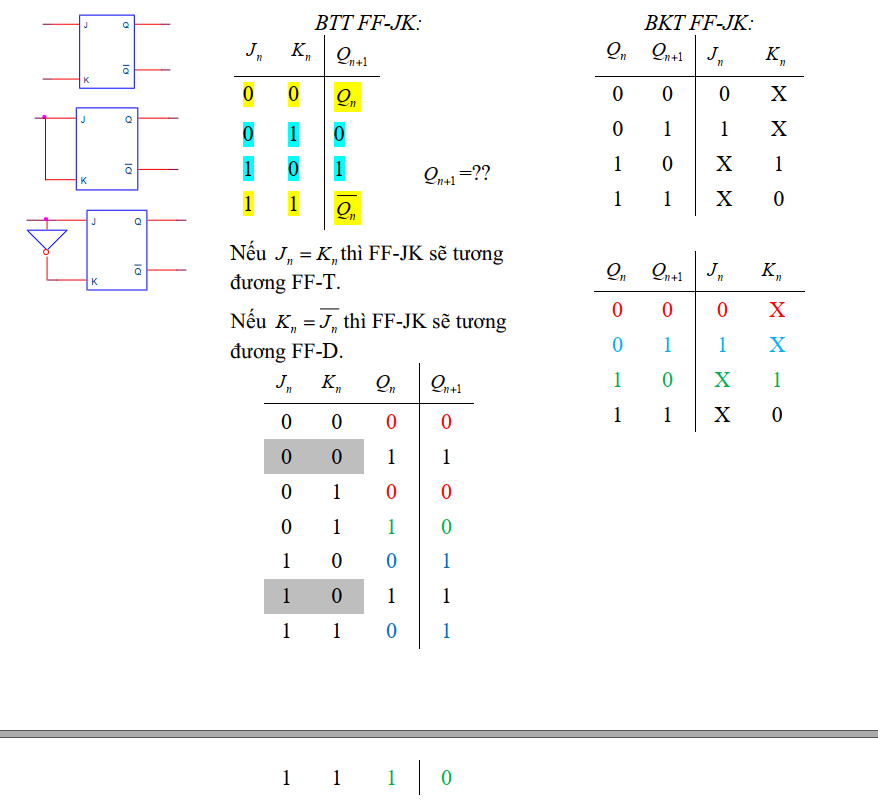

# FLIPFLOP

1. NGÕ VÀO: 
    * Xung clk: 
        Tín hiệu tuần hoàn có chu kì, đóng vai trò xung kích flipflop hoạt động 

        CLK:
        + Tích cực cạnh lên - mức cao (tam giác)
        + Tích cực cạnh xuống - mức thấp (vòng tròn)

    * Ngõ vào đồng bộ: (SR, JK, D, T)
        Khi có xung clk kích -> sự thay đổi các ngõ này -> ảnh hưởng đến ngõ RA 
    * Ngõ vào BẤT ĐỒNG BỘ (PRE-CLR hoặc SET-RES):
        Các ngõ này tích cực -> bất chấp các ngõ còn lại -> ngõ ra luôn theo quy tắt của nó.

2. NGÕ RA 
    + Q = 0: Trạng thái thấp (*RESET*, *CLEAR*)
    + Q = 1: Trạng thái cao (*SET*, *PRESET*)

## TÓM TẮT CÁC FF:

## Quy tắt vẽ BBT của FLIPFLOP 
* Xung clock: 
    - khi có xung tác động -> FF hoạt động 
    - Không có xung tác động -> ngõ ra -> statsu: "không đổi"

* FF không có ngõ vào bất đồng bộ (không có các chân SET + CLR)
    + Khi không có xung clk tác động => ngõ ra ở trạng thái không đổi. 
    + Dựa vào CK để biết xng cạnh lên / xuống. khi xung tác động => lập BTT "ĐƠN GIẢN NHẤT".
* FF có ngõ vào bất đồng bộ
    + PRE, CLR tích cực mức cao / thấp.
    + lập BTT:
        - PRE và CLR cùng tích cực: \
            => Ngõ ra ở trạng thái cấm Q = Q(bù) = 1 (1) 
        - Chỉ PRE tích cực: Lập tức lên 1 ở ngõ ra Q (2)
        - Chỉ CLR tích cực: Lập tức xuống 0 ở ngõ ra Q (3)
        - PRE,CLR không tích cực nữa: Chèn BTT "ĐƠN GIẢN NHẤT" vào. (4) 
* NOTE: \
    Ngõ vào điều khiển Pre, Clr có thể tích cực mức thấp (L), hoặc mức cao (H) tuỳ theo từng FF ; có
ưu tiên cao nhất trong FF.
    + Khi Pre tích cực và Clr không tích cực thì ngõ ra Q=1 (Bất chấp ngõ vào data và CK)
    + Khi Clr tích cực và Pre không tích cực thì ngõ ra Q=0.
    + Khi Clr và Pre không tích cực thì ngõ ra Q phụ thuộc vào ngõ CK và các ngõ vào dữ liệu.
    + Clr và Pre không được điều khiển tích cực đồng thời

## Chuyển đổi FF
* Bảng đầu vào kích
    

* Phương pháp: \
    FF A -> FF B: \
    + Lập BTT:
        - Ngõ vào: chân FF B và chân Qn
        - Ngõ ra: chân FF A
    + Thông qua bảng đầu vào KT -> điền vào BTT
    + Rút gọn + vẽ mạch 

Ví Dụ: 
* chuyển đổi JK -> D \
    
    \
    Bìa Karnaugh \
    

# THANH GHI DỊCH 
1. Chức năng \
    + Lưu trữ dữ liệu (dữ liệu chuyển từ nối tiếp -> song song)
    + Chuyển dữ liệu ( song song -> nối tiếp )
2. Phân loại \
    + Vào nối tiếp ra nối tiếp
    + Vào nối tiếp ra song song 
    + Vào song song ra song song 
    + Vào song song ra nối tiếp 

## THIẾT KẾ THANH GHI
STEP 1:
* Flop Flop D:
    + PRE/CLR mức thấp 
    + CLK nối chung với nhau -> CLK
    + CLR nối chung -> MR
    + PRE ở trạng thái không tích cực 

STEP 2:
1. Thanh ghi vào nối tiếp ra nối tiếp
* Để dịch phải:
    + D bên trái -> Din, D phải -> Dout
    + Chân Q của FF này -> D của FF tiếp theo theo chiều Din to Dout 
* Để dịch trái:
    + D bên phải -> Din, D trái -> Dout
    + Chân Q của FF này -> D của FF tiếp theo theo chiều Din to Dout 

2. Thanh ghi vào nối tiếp ra song song
    Tương tự (1). Nhưng ngõ ra lấy từ Q của các FF. 

3. Vào song song ra song song 
    Mỗi FF có D là ngõ vào, Q là ngõ ra 

# MẠCH ĐẾM 